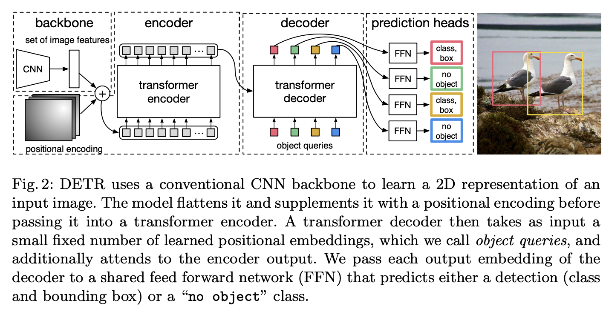
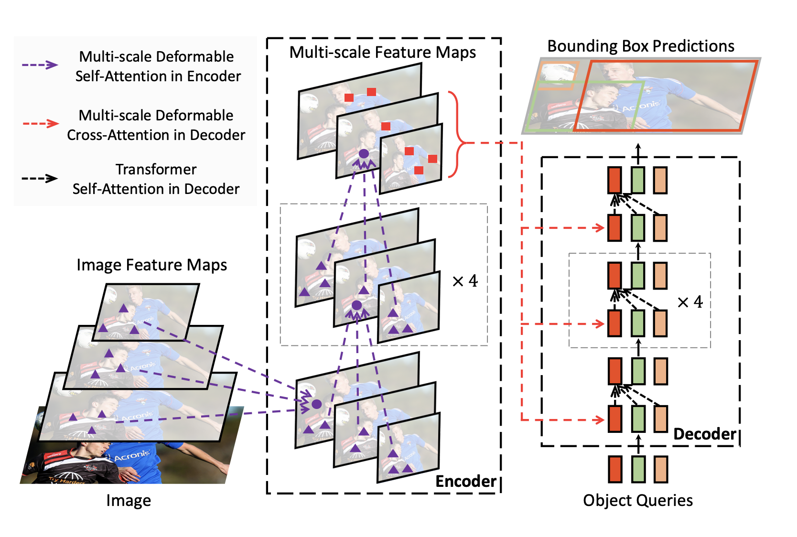
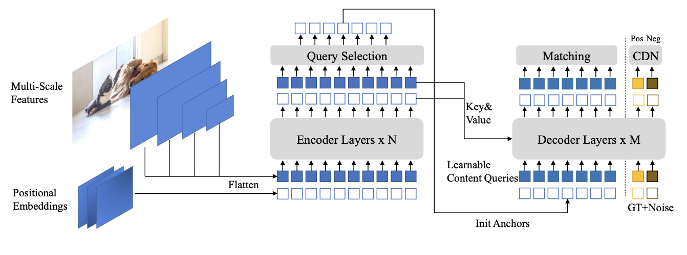

<!--_class: title-->
<!--_paginate: false-->

# 物体検出におけるTransformerの進化<br>DETR、Deformable DETR、DINOの軌跡


<div class="bg"></div>
<div class="author">

Author: [whata9292](https://x.com/whata9292)
</div>

---

<style scoped>
  h2 {
    font-size: 40px;
    margin-bottom: 30px;
  }
  ul {
    list-style-type: none;
    padding-left: 0;
  }
  li {
    font-size: 30px;
    margin-bottom: 20px;
  }
</style>

<div style="
display: flex;
flex-direction: column;
justify-content: flex-start;
align-items: flex-start;
height: 100%;
font-size: 1.0em;
padding-top: 100px;">

## 目次

- 1. 物体検出の歴史と課題
- 2. DETR: Transformerによる革新
- 3. Deformable DETR: 高速化と精度向上
- 4. DINO: 最先端の性能を実現
- 5. 進化の軌跡と将来展望
- 6. 技術比較と実装の詳細

</div>

---

## 1. 物体検出の歴史と課題

### 従来の物体検出手法

- R-CNN系列（R-CNN, Fast R-CNN, Faster R-CNN）
  - 領域提案 + 分類のTwo-Stage方式
- YOLO系列
  - 単一のネットワークによるOne-Stage検出
- SSD (Single Shot Detector)
  - マルチスケールの特徴マップを利用

### 主な課題

- 手作業による設計（アンカーボックス、NMSなど）
- End-to-Endの学習が困難
- 小物体の検出精度
- 計算コストと推論速度のトレードオフ

<!-- 主な課題としては、これまでEnd to Endの学習が困難だったこと -->

---

## 2. DETR: Transformerによる革新

### DETR (DEtection TRansformer)

<div style="display: flex; justify-content: space-between;">
<div style="width: 40%;">

### 主な特徴
- CNNバックボーン + Transformer
- オブジェクトクエリによる並列予測
- ハンガリアンマッチングでEnd-to-End学習
- Set-based損失関数

### 課題
- 長い学習時間（500エポック）
- 小物体の検出精度が低い
- 高解像度特徴マップでの計算コスト

</div>
<div style="width: 60%;">



</div>
</div>

---

## DETRの技術詳細

<div style="display: flex; justify-content: space-between; font-size: 0.8em;">
<div style="width: 48%;">

### エンコーダ
- 入力画像特徴にself-attention適用
- 位置エンコーディングの導入

### デコーダ
- オブジェクトクエリで並列予測
- Cross-attentionでエンコーダ出力と相互作用

### 損失関数
- 二部グラフマッチング
- クラス予測損失 + bbox回帰損失
- GIoU損失の導入

</div>
<div style="width: 70%;">

```python
class DETR(nn.Module):
    def __init__(self, num_classes, hidden_dim, nheads,
                 num_encoder_layers, num_decoder_layers):
        super().__init__()
        self.backbone = torchvision.models.resnet50(pretrained=True)
        self.conv = nn.Conv2d(2048, hidden_dim, 1)
        self.transformer = nn.Transformer(
            hidden_dim, nheads,
            num_encoder_layers, num_decoder_layers)
        self.linear_class = nn.Linear(hidden_dim, num_classes + 1)
        self.linear_bbox = nn.Linear(hidden_dim, 4)
        self.query_pos = nn.Parameter(torch.rand(100, hidden_dim))

    def forward(self, inputs):
        x = self.backbone(inputs)
        h = self.conv(x)
        h = self.transformer(self.pos_encoder(h.flatten(2).permute(2, 0, 1)),
                             self.query_pos.unsqueeze(1))
        return self.linear_class(h), self.linear_bbox(h).sigmoid()
```
</div>
</div>

---

## 3. Deformable DETR: 高速化と精度向上

### Deformable DETR

<div style="display: flex; justify-content: space-between;">
<div style="width: 50%;">

### 主な改善点
- Deformable Attentionの導入
- マルチスケール特徴の効率的な利用
- 学習の高速化（50エポックで収束）
- 参照点メカニズムの導入

### 成果
- 計算効率の大幅な向上
- 小物体検出精度の改善
- 収束速度の大幅な改善

</div>
<div style="width: 45%;">



</div>
</div>

---

## Deformable Attentionの詳細

<div style="display: flex; justify-content: space-between; font-size: 1em;">
<div style="width: 48%;">

### 特徴
- 少数のキーポイントのみに注目
- サンプリング位置とattention重みを学習
- マルチスケール特徴を効率的に統合

### 主要コンポーネント
1. サンプリングオフセット予測
2. アテンション重み計算
3. 値の投影と出力の生成

</div>
<div style="width: 60%;">

```python
class DeformableAttention(nn.Module):
    def __init__(self, d_model, n_heads, n_levels, n_points):
        super().__init__()
        self.d_model = d_model
        self.n_heads = n_heads
        self.n_levels = n_levels
        self.n_points = n_points
        self.sampling_offsets = nn.Linear(d_model, n_heads * n_levels * n_points * 2)
        self.attention_weights = nn.Linear(d_model, n_heads * n_levels * n_points)
        self.value_proj = nn.Linear(d_model, d_model)
        self.output_proj = nn.Linear(d_model, d_model)

    def forward(self, query, reference_points, input_flatten, input_spatial_shapes,
                input_level_start_index, input_padding_mask=None):
        N, Len_q, _ = query.shape
        N, Len_in, _ = input_flatten.shape
        value = self.value_proj(input_flatten)

        sampling_offsets = self.sampling_offsets(query).view(
            N, Len_q, self.n_heads, self.n_levels, self.n_points, 2)
        attention_weights = self.attention_weights(query).view(
            N, Len_q, self.n_heads, self.n_levels * self.n_points)
        attention_weights = F.softmax(attention_weights, -1).view(
            N, Len_q, self.n_heads, self.n_levels, self.n_points)

        sampling_locations = reference_points[:, :, None, :, None, :] \
                             + sampling_offsets / input_spatial_shapes[None, None, None, :, None, :]

        output = MSDeformAttnFunction.apply(
            value, input_spatial_shapes, input_level_start_index,
            sampling_locations, attention_weights, self.im2col_step)
        output = self.output_proj(output)
        return output
```
</div>
</div>

---

## 4. DINO: 最先端の性能を実現

### DINO (DETR with Improved DeNoising Anchor Boxes)

<div style="display: flex; justify-content: space-between;">
<div style="width: 50%;">

### 主な改善点
- Contrastive Denoising (CDN)訓練
- Mixed Query Selection
- Look Forward Twice
- 動的デノイジンググループ

### 成果
- 最先端の検出精度
- さらなる学習の安定化と高速化
- 小物体検出精度の大幅向上

</div>
<div style="width: 45%;">



</div>
</div>

---

## DINOの技術詳細

### Contrastive Denoising (CDN)

<div style="display: flex; justify-content: space-between;">
<div style="width: 50%;">

- 正例と負例を用いたデノイジング訓練
- 重複検出の抑制と高品質なアンカー選択
- Focal Lossの導入による不均衡クラス問題の緩和
</div>

<div style="width: 45%;">

```python
class ContrastiveDenoising(nn.Module):
    def __init__(self, hidden_dim, num_classes):
        super().__init__()
        self.class_embed = nn.Linear(hidden_dim, num_classes + 1)
        self.bbox_embed = MLP(hidden_dim, hidden_dim, 4, 3)

    def forward(self, hs, init_reference, inter_references):
        outputs_classes = []
        outputs_coords = []
        for lvl in range(hs.shape[0]):
            reference = init_reference if lvl == 0 else inter_references[lvl - 1]
            reference = inverse_sigmoid(reference)
            outputs_class = self.class_embed(hs[lvl])
            tmp = self.bbox_embed(hs[lvl])
            tmp[..., :2] += reference[..., :2]
            tmp[..., :2] = tmp[..., :2].sigmoid()
            tmp[..., 2:] = tmp[..., 2:].exp()
            outputs_coord = tmp
            outputs_classes.append(outputs_class)
            outputs_coords.append(outputs_coord)
        return outputs_classes, outputs_coords

def cdn_loss(outputs, targets, num_boxes, focal_alpha):
    prob = outputs["pred_logits"].sigmoid()
    labels = targets["labels"]
    boxes = targets["boxes"]

    pos_inds = labels != num_boxes
    neg_inds = labels == num_boxes

    pos_loss = focal_loss_jit(
        prob[pos_inds], labels[pos_inds], alpha=focal_alpha, gamma=2.0, reduction="sum"
    )
    neg_loss = focal_loss_jit(
        prob[neg_inds], labels[neg_inds], alpha=focal_alpha, gamma=2.0, reduction="sum"
    )

    num_pos = pos_inds.sum().float()
    pos_loss = pos_loss / num_pos
    neg_loss = neg_loss / num_pos

    loss = pos_loss + neg_loss
    return loss
```
</div>
</div>

---

## Mixed Query Selection & Look Forward Twice

<div style="display: flex; justify-content: space-between;">
<div style="width: 48%;">

### Mixed Query Selection

```python
class MixedQuerySelection(nn.Module):
    def __init__(self, hidden_dim, num_queries):
        super().__init__()
        self.content_queries = nn.Parameter(torch.randn(num_queries, hidden_dim))
        self.position_proj = nn.Linear(hidden_dim, hidden_dim)

    def forward(self, encoder_output):
        B, C, H, W = encoder_output.shape
        encoder_output = encoder_output.flatten(2).permute(0, 2, 1)

        # Select top-k features
        topk_values, topk_indices = torch.topk(
          encoder_output.max(dim=-1)[0],
          k=self.num_queries,
          dim=1
        )
        topk_features = torch.gather(
          encoder_output,
          1,
          topk_indices.unsqueeze(-1).expand(
            -1, -1, C
          )
        )

        # Generate position queries
        position_queries = self.position_proj(topk_features)

        # Combine content and position queries
        queries = self.content_queries.unsqueeze(0).expand(B, -1, -1) ¥
        + position_queries
        return queries
```

</div>

<div style="width: 45%;">

### Look Forward Twice

```python
def look_forward_twice(decoder_outputs, targets):
    all_layers_losses = []
    for layer_output in decoder_outputs:
        layer_loss = compute_loss(layer_output, targets)
        all_layers_losses.append(layer_loss)

    # Compute gradients for current and next layer
    for i in range(len(all_layers_losses) - 1):
        current_loss = all_layers_losses[i]
        next_loss = all_layers_losses[i + 1]
        combined_loss = current_loss + 0.5 * next_loss
        combined_loss.backward(retain_graph=True)

    # Compute gradient for the last layer
    all_layers_losses[-1].backward()
```
</div>

---

## 6. 技術比較と実装の詳細

<div style="
display: flex;
justify-content: center;
align-items: center;
height: 100%;
font-size: 1.0em;">
<style>
  table {
    border-collapse: collapse;
    width: 90%; /* 幅を90%に設定して余白を作る */
  }
  th, td {
    border: 1px solid #ddd;
    padding: 6px;
    text-align: left;
  }
  th {
    background-color: #f2f2f2;
    font-size: 24px;
  }
  tr:nth-child(even) {
    background-color: #f9f9f9;
  }
</style>

<table>
  <tr>
    <th>特徴</th>
    <th>DETR</th>
    <th>Deformable DETR</th>
    <th>DINO</th>
  </tr>
  <tr>
    <td>注意機構</td>
    <td>全画素に対する注意</td>
    <td>Deformable Attention</td>
    <td>Deformable Attention + CDN</td>
  </tr>
  <tr>
    <td>マルチスケール</td>
    <td>非対応</td>
    <td>対応</td>
    <td>対応（改良版）</td>
  </tr>
  <tr>
    <td>学習速度</td>
    <td>遅い（500エポック）</td>
    <td>速い（50エポック）</td>
    <td>さらに速い（12-24エポック）</td>
  </tr>
  <tr>
    <td>小物体検出</td>
    <td>弱い</td>
    <td>改善</td>
    <td>さらに改善</td>
  </tr>
  <tr>
    <td>計算効率</td>
    <td>低い</td>
    <td>高い</td>
    <td>高い</td>
  </tr>
  <tr>
    <td>クエリ選択</td>
    <td>固定</td>
    <td>動的</td>
    <td>Mixed Query Selection</td>
  </tr>
  <tr>
    <td>損失関数</td>
    <td>Set-based損失</td>
    <td>Set-based損失</td>
    <td>Contrastive Denoising損失</td>
  </tr>
  <tr>
    <td>バックボーン</td>
    <td>ResNet</td>
    <td>ResNet</td>
    <td>ResNet, Swin Transformer</td>
  </tr>
</table>
</div>

---

## 今後の課題

<div style="
display: flex;
justify-content: center;
align-items: center;
height: 100%;
font-size: 1.0em;">
<style>
  table {
    border-collapse: collapse;
    width: 90%;
  }
  th, td {
    border: 1px solid #ddd;
    padding: 6px;
    text-align: left;
  }
  th {
    background-color: #f2f2f2;
    font-size: 24px;
  }
  tr:nth-child(even) {
    background-color: #f9f9f9;
  }
</style>
<table>
  <tr>
    <th>将来の研究方向</th>
    <th>具体的なアプローチ</th>
  </tr>
  <tr>
    <td>1. モデルの軽量化</td>
    <td>
      - 知識蒸留技術の活用<br>
      - ニューラルアーキテクチャサーチ (NAS) の適用
    </td>
  </tr>
  <tr>
    <td>2. マルチタスク学習</td>
    <td>
      - パノプティックセグメンテーションへの拡張<br>
      - 3D物体検出との統合
    </td>
  </tr>
  <tr>
    <td>3. 自己教師あり学習</td>
    <td>
      - コントラスティブ学習の改良<br>
      - マスク自己教師学習の導入
    </td>
  </tr>
  <tr>
    <td>4. リアルタイム処理</td>
    <td>
      - モデル量子化技術の適用<br>
      - ハードウェアアクセラレータの最適化
    </td>
  </tr>
  <tr>
    <td>5. 解釈可能性の向上</td>
    <td>
      - 注意マップの可視化技術の改良<br>
      - 説明可能AIとの統合
    </td>
  </tr>
</table>
</div>

---

## まとめ

- Transformerが物体検出に革新をもたらした
- DETR、Deformable DETR、DINOと進化
  - 学習効率の大幅な改善
  - 小物体検出精度の向上
  - 計算効率と精度のトレードオフの最適化
- 高精度、高効率、End-to-Endの検出を実現
- 今後の課題:
  - さらなる軽量化と高速化
  - より汎用的なマルチタスクモデルの開発
  - 自己教師あり学習の統合

---

<!-- _class: section -->
# ご清聴ありがとうございました

質問やディスカッションをお待ちしています。

---

## Appendix: 実装の詳細 (Attention機構の比較)

### DETR: Standard Attention

<div style="width:85%;">

```python
class MultiheadAttention(nn.Module):
    def __init__(self, d_model, num_heads):
        super().__init__()
        self.num_heads = num_heads
        self.d_model = d_model
        self.head_dim = d_model // num_heads

        self.q_linear = nn.Linear(d_model, d_model)
        self.k_linear = nn.Linear(d_model, d_model)
        self.v_linear = nn.Linear(d_model, d_model)
        self.out_linear = nn.Linear(d_model, d_model)

    def forward(self, query, key, value, mask=None):
        batch_size = query.size(0)

        Q = self.q_linear(query).view(batch_size, -1, self.num_heads, self.head_dim).transpose(1, 2)
        K = self.k_linear(key).view(batch_size, -1, self.num_heads, self.head_dim).transpose(1, 2)
        V = self.v_linear(value).view(batch_size, -1, self.num_heads, self.head_dim).transpose(1, 2)

        scores = torch.matmul(Q, K.transpose(-2, -1)) / math.sqrt(self.head_dim)
        if mask is not None:
            scores = scores.masked_fill(mask == 0, -1e9)
        attn = F.softmax(scores, dim=-1)

        context = torch.matmul(attn, V)
        context = context.transpose(1, 2).contiguous().view(batch_size, -1, self.d_model)
        output = self.out_linear(context)
        return output
```
</div>

---

### Deformable DETR: Deformable Attention

<div style="width:75%;">

```python
class DeformableAttention(nn.Module):
    def __init__(self, d_model, n_heads, n_levels, n_points):
        super().__init__()
        self.d_model = d_model
        self.n_heads = n_heads
        self.n_levels = n_levels
        self.n_points = n_points
        self.sampling_offsets = nn.Linear(d_model, n_heads * n_levels * n_points * 2)
        self.attention_weights = nn.Linear(d_model, n_heads * n_levels * n_points)
        self.value_proj = nn.Linear(d_model, d_model)
        self.output_proj = nn.Linear(d_model, d_model)

    def forward(self, query, reference_points, input_flatten, input_spatial_shapes,
                input_level_start_index, input_padding_mask=None):
        N, Len_q, _ = query.shape
        N, Len_in, _ = input_flatten.shape
        value = self.value_proj(input_flatten)

        sampling_offsets = self.sampling_offsets(query).view(
            N, Len_q, self.n_heads, self.n_levels, self.n_points, 2)
        attention_weights = self.attention_weights(query).view(
            N, Len_q, self.n_heads, self.n_levels * self.n_points)
        attention_weights = F.softmax(attention_weights, -1).view(
            N, Len_q, self.n_heads, self.n_levels, self.n_points)

        sampling_locations = reference_points[:, :, None, :, None, :] \
                             + sampling_offsets / input_spatial_shapes[None, None, None, :, None, :]

        output = MSDeformAttnFunction.apply(
            value, input_spatial_shapes, input_level_start_index,
            sampling_locations, attention_weights, self.im2col_step)
        output = self.output_proj(output)
        return output
```
</div>

---

### DINO: Enhanced Deformable Attention with CDN


<div style="display: flex; justify-content: space-between;">
<div style="width:45%;">

```python
class DINOAttention(nn.Module):
    def __init__(self, d_model, n_heads, n_levels, n_points, n_groups):
        super().__init__()
        self.deformable_attention = DeformableAttention(
          d_model, n_heads, n_levels, n_points
        )
        self.cdn = ContrastiveDenoising(d_model, n_groups)

    def forward(
      self, query, reference_points,
      input_flatten, input_spatial_shapes,
      input_level_start_index,
      input_padding_mask=None
    ):
        # Deformable Attention
        deform_output = self.deformable_attention(
          query,
          reference_points,
          input_flatten,
          input_spatial_shapes, input_level_start_index,
          input_padding_mask
        )

        # Contrastive Denoising
        cdn_output = self.cdn(
          deform_output,
          reference_points
        )

        return cdn_output
```
</div>

<div style="width:50%;">

```python
class ContrastiveDenoising(nn.Module):
    def __init__(self, d_model, n_groups):
        super().__init__()
        self.n_groups = n_groups
        self.group_proj = nn.Linear(d_model, n_groups * d_model)

    def forward(self, x, reference_points):
        B, N, C = x.shape
        group_features = self.group_proj(x).view(B, N, self.n_groups, C)

        # Generate positive and negative samples
        pos_samples = group_features + torch.randn_like(group_features) * 0.1
        neg_samples = group_features + torch.randn_like(group_features) * 0.3

        # Compute contrastive loss
        pos_loss = F.mse_loss(pos_samples, group_features)
        neg_loss = torch.max(
          torch.zeros_like(neg_samples),
          0.5 - F.mse_loss(
            neg_samples,
            group_features
          )
        )

        cdn_loss = pos_loss + neg_loss.mean()

        return x, cdn_loss
```
<div>
